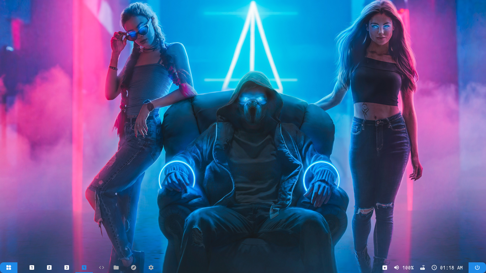
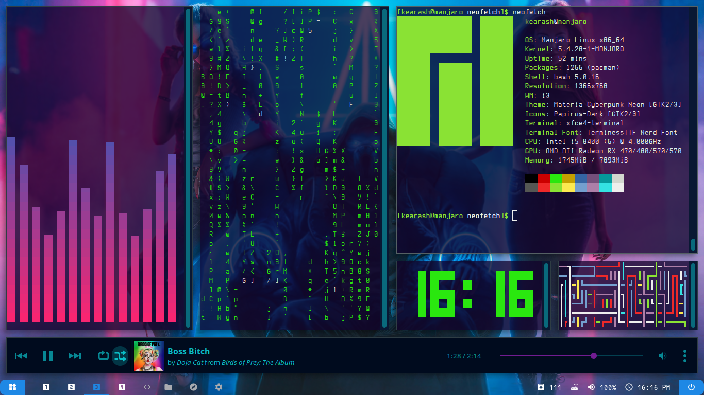

# i3-gaps-cyberpunk-2020

Cyberpunk 2020 Dot files
---
**OS**: Manjaro linux 

**WM**: i3-gaps 

**Bar**: polybar

**GTK theme**: Materia-cyberpunk-neon

**Icon theme**: Papirus-Dark

**Terminal**: xfce4-terminal

If you are here you may seen some screenshots from my reddit or my instagram account
I think every thing is clear in screenshots but there is some **Notes:**

- The color palette of terminal is visible in "neofetch"
- Opacity of terminal is 0.75
- "Code - OSS" and "Discord" is transparent within "compton.conf" file
